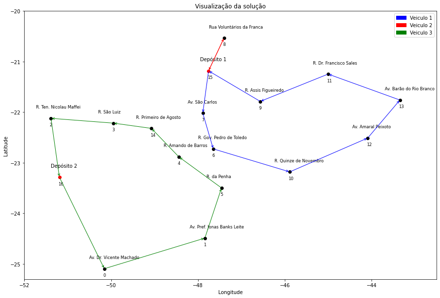
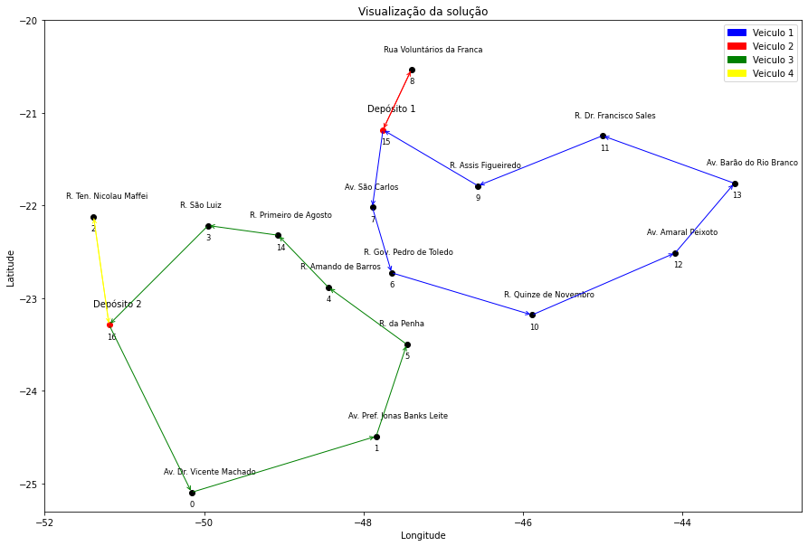

# MDVRP-Magazine-Luiza

LE505A - Operations Research course at Unicamp

The following project presents a problem that uses data on the locations of 15 stores and 2 distribution centers of the company Magazine Luiza, in which we seek, with the help of Operations Research, to find effective solutions to the Multi-Depot Vehicle Routing Problem (MDVRP).

## Contents
- [Requirements](#Requirements)
- [Modeling](#Modeling)       
- [Analysis](#Analysis)
- [Solutions](#Solutions)
- [References](#References)

## Requirements

```bash
python pip install -r requirements.txt
```
## Modeling

### Objective Function

 The objective function Z seeks to find routes between N destinations and M origins that minimize the total cost for the carriers, so that \[c_{ij}\] is the distance from city i to city j

\[ \min Z = \sum_{i=1}^{N+M} \sum_{j=1}^{N+M} c_{ij} x_{ij} \]

### Subject to

1. Each destination city is served only once, and that all cities must be visited:
\[ \sum_{i=1}^{N+M} x_{ij} = 1 \quad \text{for} \quad j = 1, 2, ..., N \] 

\[ \sum_{j=1}^{N+M} x_{ij} = 1 \quad \text{for} \quad i = 1, 2, ..., N \]

2. All vehicles are used for transportation:
\[ \sum_{i=N+1}^{N+M} \sum_{j=1}^{N+M} x_{ij} = V \]
\[ \sum_{j=N+1}^{N+M} \sum_{i=1}^{N+M} x_{ij} = V \]

3. Binary variable constraint:
\[ x_{ij} = 0 \text{ or } 1 \quad \text{for all} \quad i, j \]

4. Vehicles cannot travel directly between depots:
\[ x_{ij} = 0 \quad \text{for} \quad i = N + 1, N + 2, ..., N + M \quad \text{and} \quad j = N + 1, N + 2, ..., N + M \]

5. The following constraints play a dual role in the MDVRP model: they are capacity constraints and subroute elimination constraints2. They belong to a class of Miller-Tucker-Zemlin (MTZ) arc product flow constraints, which appear in polynomial quantity in the model, which is an advantage since they differ from typical exponentially growing subroute elimination constraints in relation to the input data. However, as a disadvantage, they produce a weak linear relaxation in the resolution of the relaxed model during the branch-and-bound process. The variables 𝑢 and 𝑦 must be non-negative, given a value at each vertex except the depots, not allowing disconnected sub-routes to occur in the optimal solution, since they define a certain order in which the flow of cargo in the vehicle must traverse the arcs along the customer visits

\[ u_i - u_j + Px_{ij} \leq P - Q_i \quad \text{for} \quad 1 \leq i \neq j \leq N \]

\[ y_i - y_j + Lx_{ij} \leq L - 1 \quad \text{for} \quad 1 \leq i \neq j \leq N \]

6. Moreover, if it is established, for example, that a total of 2 vehicles must be used, the model might allocate no vehicles to one depot and 2 vehicles to the other. Therefore, to conduct computational experiments, constraints were considered that do not allow such a situation to occur, defining a fixed number of vehicles for each depot:

\[ \sum_{j=1}^{N+M} x_{ij} = V_i \quad \text{for} \quad i = N + 1, N + 2, ..., N + M \]

\[ \sum_{i=1}^{N+M} x_{ij} = V_j \quad \text{for} \quad j = N + 1, N + 2, ..., N + M \]


## Analysis

### Logistics Information

| Parameter                     | Value |
|-------------------------------|-------|
| Number of destinations        | 15    |
| Number of depots              | 2     |
| Total number of cities        | 17    |
| Vehicle capacity              | 20    |

### Customer Demand

| Customer | Demand |
|----------|--------|
| 0        | 2      |
| 1        | 2      |
| 2        | 2      |
| 3        | 3      |
| 4        | 1      |
| 5        | 3      |
| 6        | 1      |
| 7        | 1      |
| 8        | 2      |
| 9        | 3      |
| 10       | 2      |
| 11       | 2      |
| 12       | 3      |
| 13       | 2      |
| 14       | 3      |

**Note**: The number of vehicles will be tested for multiple values and will be described throughout the code.

**Note** : The database is private

### Distance matrix


### Locations

The deposits are highlighted in red


## Solutions

### Considering vehicle capacity and customer demand

| 2 vehicles                               | 3 vehicles                               |
|------------------------------------------|------------------------------------------|
|   |   |

|                   4 vehicles                      |
|:---------------------------------------------:|
|        |

### Considering the maximum number of destinations each vehicle can visit

|                   5 vehicles                      |
|:---------------------------------------------:|
|       |

### Defining a fixed number of vehicles for each depot and assuming we have 2 vehicles for each depot


|                   4 vehicles                      |
|:---------------------------------------------:|
|        | 


**sensitivity analysis**

- By reducing the capacity to 16, it can be seen that there was no change in the solutions found. However, by reducing the capacity to 15, the solver spent 2 hours on computation and was unable to find a solution. Therefore, the implementation was interrupted.

- Other tests have been carried out, changing the maximum number of vertices that each vehicle can visit. However, the tests are limited to the ratio (number of stores)/(number of vehicles), i.e. in any test in which the number of vehicles multiplied by the maximum number of vertices is less than the number of cities(V*L < N), the model does not reach a conclusion, and continues searching for a solution indefinitely.

## References
[1] KULKARNI , R.V.; BHAVE, P. R, Integer programming formulations of
vehicle routing problems. India. 2011.